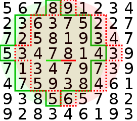

Problem
-------

[XOR Point Weights in Circles](https://www.hackerrank.com/contests/101hack43/challenges/xor-point-weights-in-circles)
from hackerrank.

Given a matrix of size `n * m` with values `w(i,j)`. Let `f(i,j,r)` be a summ of all values in matrix
in radius `r` around point `(i,j)` (e.g. all `(x,y)` where `(x - i)^2 + (y - j)^2 <= r^2`).

The task is to find XOR value of all `f(i,j,r)` for a given `r` value.

Limits
------

`1 <= n, m <= 300`

`0 <= r <= 1000`

`0 <= w(i,j) <= 10^4`

Solution
--------

It is pretty straightforward. Lets imagine we calculate each `f(i,j,r)` using scan-line around it's position.
For each scan-line it is obvious that `f(i,j,r)` and `f(i,j + 1, r)` have a lot in common, so, we can
efficienlty calculate them one by one (by removing left-most number from scan-line value, and adding 
right-most, new one).

We see that moving right by `dx` elements, moves our circle bounds respectively, which is a place for optimization.